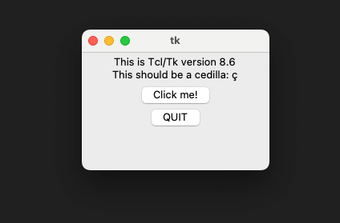

[< Home](../README.md)

# 2. Tkinter
Para implementar interfaces de usuario usaremos el módulo **Tkinter**, el cual es un puente entre Python y la 
librería Tcl/Tk (Tcl: Lenguaje / Tk: Librería gráfica). **Tkinter** viene incluido en la instalación de Python 
para Windows, pero para Linux y Mac en ocasiones requiere un proceso de instalación adicional. 

### Validar instalación de Tkinter
1. Crear un archivo denominado "validar-tkinter.py" e ingresar el siguiente código en él:
    ```python
    import tkinter
    
    tkinter._test()
    ```

2. Ejecutar el archivo desde la terminal:
    ```bash
    $ python3 src/validar-tkinter.py
    ```

3. El resultado de la ejecución será la siguiente ventana:

    

    > **Nota:** También existen otras formas de validar la instalación de Tkinter. Por ejemplo, desde la terminal 
      ejecutando el comando *"python3 -m tkinter"*, el cual abrirá la misma ventana de prueba.

### Para usuarios Linux y Mac
Para los usuarios de Linux y Mac, en la mayoría de los casos el módulo Tkinter no estará incluido con la instalación 
base de Python. Debido a ello seguir las siguientes instrucciones: 

* Si usas Linux, prueba instalar la librería con el comando: 
    ```bash
    $ sudo apt-get install python3-tk
    ```
  
* Si usas Mac, prueba instalar la librería con el comando:
    ```bash
    $ brew install tkinter
    ```
    > **Nota:** Puedes instalar y desinstalar paquetes desde Mac usando *Homebrew*, los comandos más usados son:
      Instalar(*brew install package*), Desinstalar(*brew uninstall package*), Limpiar(*brew cleanup package*), 
      Buscar(*brew search package*), Listar paquetes instalados(*brew list*).

* Listo!, ya puedes empezar con Tkinter.