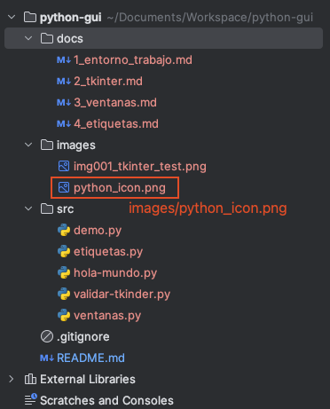

[< Home](../README.md)

# 3. Ventanas
 Uno de los componentes principales de **Tkinter**, son las ventanas.

* Para crear una ventana tenemos el siguiente código:
    ```python
    from tkinter import *

    # Iniciacializar ventana
    ventana = Tk()

    # Propiedades de ventana
    ventana.title("Mi primera ventana")
    ventana.geometry("1024x768")
    ventana.resizable(True,True)
    ventana.config(background="#336699")
    logo = PhotoImage(file="images/python_icon.png")
    ventana.iconphoto(True,logo)

    # Pintar ventana
    ventana.mainloop()
    ```
    ### Descripción de la implementación
    - El primer paso es importar las librerías de **Tkinter**, necesarias para la implementación de 
      la ventana:
      ```python
      from tkinter import *
      ```
  
    - Segundo, creamos un objeto *ventana* de la clase *Tk*, este objeto será el principal:
      ```python
      ventana = Tk()
      ```  

    - Tercero, aplicamos 5 propiedades sobre nuestro objeto *ventana*:  
      - Asignar un título a la ventana:
        ```python
        ventana.title("Mi primera ventana")
        ```
      
      - Establecer las dimensiones de la ventana:
        ```python
        ventana.geometry("1024x768")
        ```
  
      - Permitir que la ventana sea redimensionable:
        ```python
        ventana.resizable(True, True)
        ```
         
      - Asignar un color de fondo:
        ```python
        ventana.config(background="#336699")
        ```
      
      - Establecer un ícono para la ventana:
        ```python
        logo = PhotoImage(file="images/python_icon.png")
        ventana.iconphoto(True, logo)
        ```
        Como vemos, la clase *PhotoImage* recibe la ruta de la imagen como parámetro. *¿Cuál es la ruta correcta 
        a la que debemos referenciar?*. Pues la respuesta correcta dependerá desde que directorio base se está 
        ejecutando el fichero python. Por ejemplo esta es la estructura de directorios del proyecto:
        
        
      
        Si ejecutamos el fichero *ventanas.py* desde la raíz (*python-gui*):
        ```python
        python3 src/ventanas.py
        ```
        Entonces todos los recursos los tendremos que referenciar desde la raíz (El directorio *python-gui*). En ese
        sentido la imagen también debería ser referenciada como si se invocara desde la raíz 
        (*images/python_icon.png*).  
        
        > **Nota:** En Mac el ícono podría no visualizarse, esto se debe a que este sistema operativo requiere 
          configuraciones adicionales por ser visualmente más restrictiva.

    - Cuarto y paso final, pintar la ventana: 
      ```python
      ventana.mainloop()
      ```
      > La función *mainloop()* permite pintar la ventana y su nombre como tal, hace referencia a un bucle en 
        ejecución, puesto que una ventana tiene la capacidad de detectar eventos o comportamientos gatillados 
        por el usuario.
    
    - Listo!, ya sabes crear ventanas.